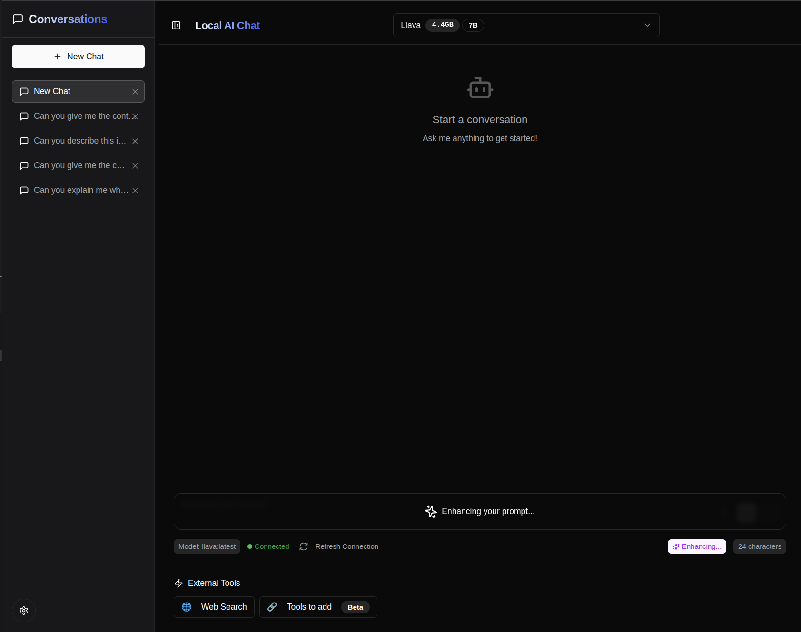
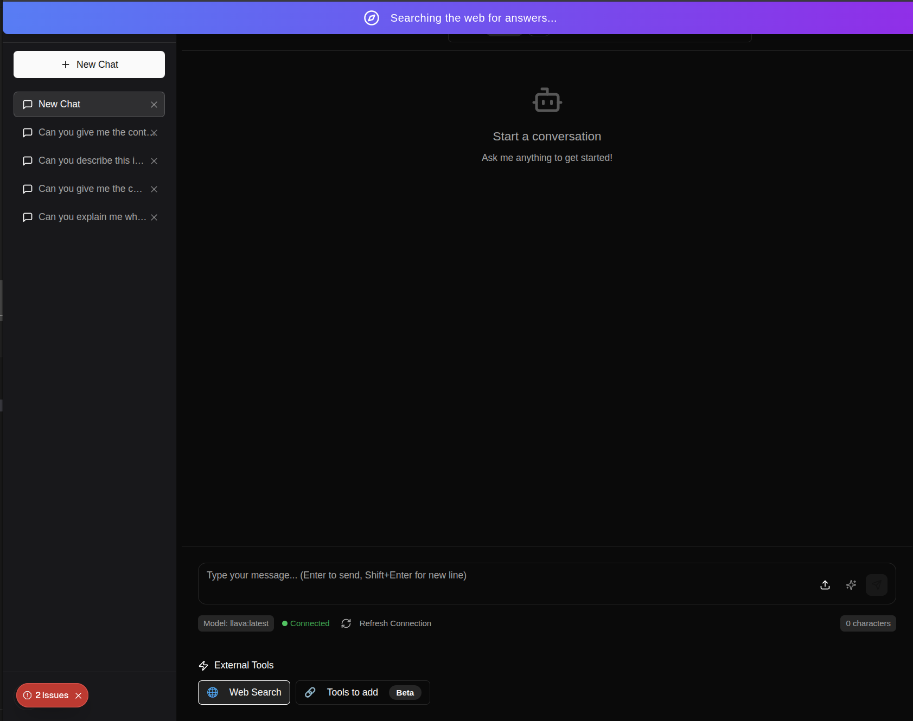
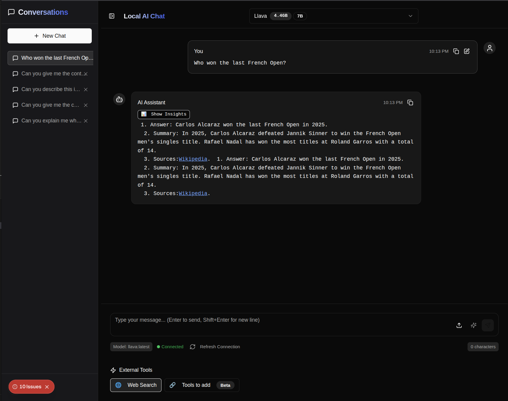

# Local Chat

<p align="center">
  
</p>

<h1 align="center">Local Chat</h1>

<p align="center">
  A user interface for local AI Large Language Models (LLMs) running with Ollama.
</p>

<p align="center">
  
  
</p>

## Introduction

This project is a user interface for a local AI Large Language Model (LLM) running with Ollama. It uses Ollama for running local models and LangChain on the backend for Retrieval-Augmented Generation (RAG).


## Features

*   **Chat with Local Models:** Chat with any of the models you have downloaded locally with Ollama.
*   **Code Interaction:** The application supports code blocks, allowing you to easily share and discuss code with the AI.
*   **Prompt Enhancement:** The "Enhance" button helps you improve your prompts for better responses from the AI.
*   **Ollama Connection Status:** The application indicates whether you are connected to the Ollama server.
*   **File and Image Uploads:** You can upload files and images to the chat. This feature is designed to be used with multimodal models that can understand and process visual information.
*   **Web Search:** The application can search the web using the DuckDuckGo API.

## Getting Started

### Prerequisites

*   [Node.js](https://nodejs.org/) (v22 or later)
*   [pnpm](https://pnpm.io/)
*   [Ollama](https://ollama.ai/)

### Installation

1.  **Install Ollama:** Download and install Ollama from the official website: [https://ollama.ai/](https://ollama.ai/)
2.  **Download a Model:** Open your terminal and pull a model using the following command. For example, to download the Llama 3.2 model, you would run:

    ```bash
    ollama pull llama3.2
    ```

3.  **Serve Ollama:** To use Ollama as a server, run the following command in your terminal:

    ```bash
    ollama serve
    ```

4.  **Clone the Repository:** Clone this repository to your local machine.
5.  **Install Dependencies:** Open a terminal in the project's root directory and run:

    ```bash
    pnpm install
    ```

6.  **Run the Application:** Finally, start the development server:

    ```bash
    pnpm dev
    ```

    The application will be available at `http://localhost:3000`.

## Usage

### Chat with Your Local Models

You can chat with any of the models you have downloaded locally with Ollama. Simply select the model you want to use from the dropdown list at the top of the chat interface.


### Interact with Code

The application supports code blocks, allowing you to easily share and discuss code with the AI.


### Enhance Your Prompts

The "Enhance" button helps you improve your prompts for better responses from the AI.



### Web Search

The application can search the web using the DuckDuckGo API. It then attempts to scrape the content of the search results to provide you with the most relevant information. However, this feature is not perfect and may sometimes fail to scrape the content correctly, as some websites are difficult to scrape. As you can see in the image below, there are some errors in the console which are due to scraping errors on the web search.



But, as you can see, it can also work.



To have better results, it would be necessary to switch to solutions with search APIs made for AIs, like Tavily.

## Future Improvements

This project is a work in progress, and there are many ways it could be improved. Here are a few ideas:

*   **Use Tavily for Web Searches:** Instead of relying on DuckDuckGo and web scraping, the application could use [Tavily](https://tavily.com/), a search API designed specifically for AI applications.
*   **Add Audio Features:** It would be great to add audio features using [Whisper.cpp](https://github.com/ggerganov/whisper.cpp) to allow for voice input and output.
*   **Integrate MCP Tools:** The application could be extended with additional tools, as suggested by the button on the bottom of the interface.
*   **Persistent Message History:** To keep the chat history between sessions, a persistent database could be integrated.

## Contributing

This project was created for fun and to experiment with new features as a computer science student. If you would like to contribute to the project or have ideas for improvements, feel free to open an issue or a pull request. All contributions are welcome!

## Acknowledgments

*   [Ollama](https://ollama.ai/) for making it easy to run LLMs locally.
*   [LangChain](https://www.langchain.com/) for providing the tools to build AI-powered applications.
*   [Next.js](https://nextjs.org/) for the amazing React framework.
*   [Tailwind CSS](https://tailwindcss.com/) for the utility-first CSS framework.
*   [shadcn/ui](https://ui.shadcn.com/) for the beautiful UI components.